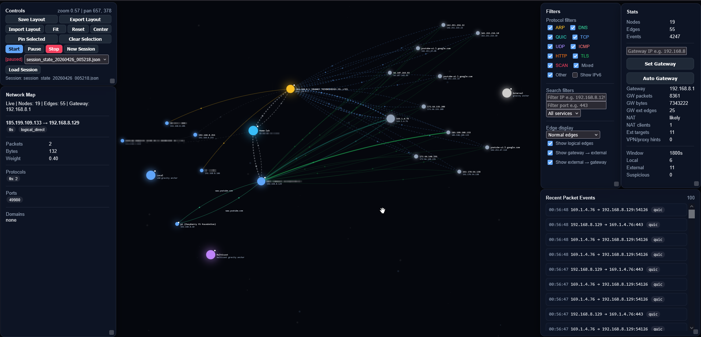

# Network Graph Monitor

A local network monitoring and visualization tool built with Python, Scapy, and a browser-based canvas UI.

The tool captures packets from the local machine, analyzes network activity, and renders an interactive live graph showing devices, traffic flows, protocols, services, gateway routing, switch/L2 hints, multicast activity, and suspicious behavior indicators.

## Features

- Live packet capture using Scapy
- Interactive browser-based network graph
- Local, external, gateway, multicast, broadcast, and switch/L2 node grouping
- Protocol and service detection:
  - ARP, DNS, ICMP, TCP, UDP
  - HTTP, TLS, QUIC, SMB, RDP, SSH, DHCP, SNMP, and others
  - Basic OT/ICS protocol hints such as Modbus, S7, BACnet, OPC-UA
- Layer 2 detection for traffic such as STP/CDP-style packets
- Gateway-aware visual routing:
  - Local → Switch → Gateway → External
- Optional logical edges for actual source/destination visibility
- Edge display modes:
  - Normal
  - Quiet low-volume
  - Highlight top talkers
  - Backbone emphasis
- IPv6 show/hide toggle
- Multicast anchor to reduce layout clutter
- Vendor lookup using IEEE OUI CSV
- Session-based capture history
- Basic risk/suspicious node scoring with visible findings
- Export/import UI layouts

## Requirements

- Python 3.11+
- `Npcap` installed on Windows
- Administrator privileges for packet capture
- Python dependencies from `requirements.txt`

## Project Structure
```
Network_graph/
├─ backend/
│  ├─ server.py
│  ├─ capture.py
│  ├─ analyzer.py
│  ├─ graph_builder.py
│  ├─ identity.py
│  ├─ session_manager.py
│  ├─ oui.csv
│  └─ sessions/
├─ frontend/
│  ├─ index.html
│  └─ layouts/
├─ requirements.txt
├─ .gitignore
└─ README.md
```

## Install dependencies:

It is recommended to use a Python virtual environment.

```bash
# Create virtual environment
python -m venv venv

# Activate it
# Windows:
venv\Scripts\activate

# Linux / macOS:
source venv/bin/activate

# Install dependencies
pip install -r requirements.txt
```

`Install Npcap:` https://npcap.com/

## OUI Vendor Lookup

The tool can use the IEEE OUI CSV file for MAC vendor lookup.

Expected location:

```bash
backend/oui.csv
```
This file is ignored by Git because it is large and can be downloaded separately.

`Download from:` https://standards-oui.ieee.org/oui/oui.csv

## Running

### From the project root:
`Run terminal as Administrator`
```bash
python backend/server.py
```
Then open in your browser: 

http://localhost:8000 

Start capture from the UI.

## Security / Privacy

1. This tool captures local network metadata and packet-derived information.
2. Only use it on networks where you have permission to monitor traffic.
3. Session files may contain:
    - IP addresses
    - Hostnames
    - DNS names
    - MAC addresses
    - Observed services

## Status

`Experimental / lab tool.`

The goal is not to *replace* Wireshark, but to provide a quick visual overview of network activity.

## Packet Capture Notes

### On a typical switched network, you will only see:

#### Traffic to/from the machine running the tool
    - Broadcast traffic
    - Multicast traffic
    - Some Layer 2 control traffic

#### To capture traffic between other devices:

    - Use a switch SPAN / mirror port
    - Capture from that mirrored interface

### Wi-Fi Note

#### Capturing from a Wi-Fi client usually does not show all traffic from other devices unless:
  
    - Monitor mode is supported
    - Or the access point/router mirrors traffic

## License

This project is licensed under the MIT License.

## Preview

