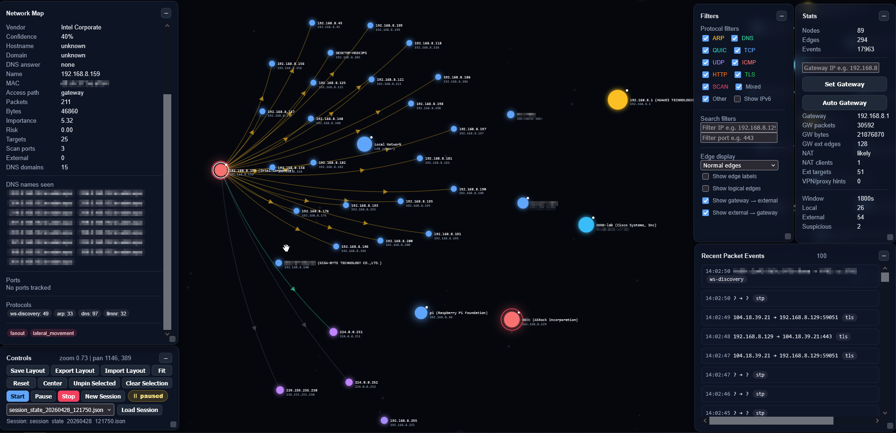
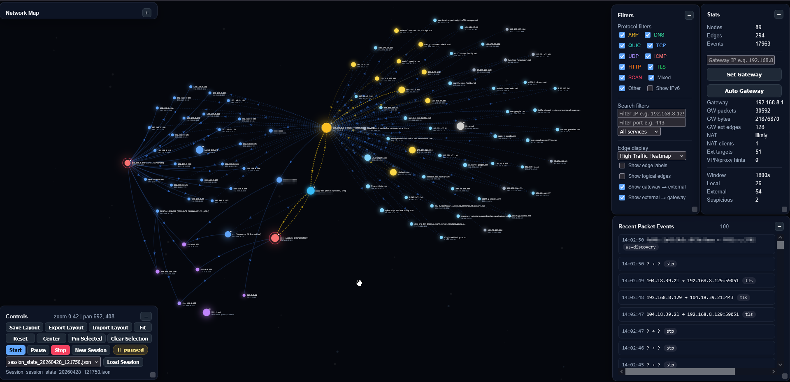
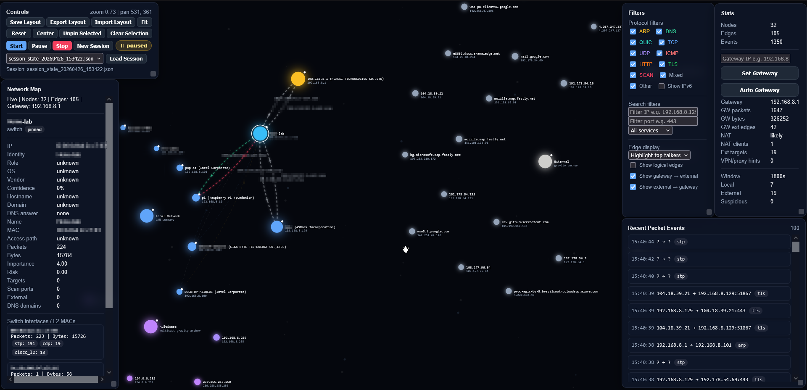
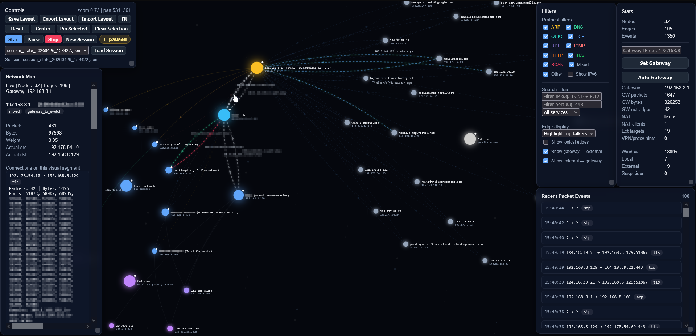

# Network Graph Monitor

A topology-aware, behavior-aware network visualization and analysis tool built with Python, Scapy, and a browser-based canvas UI.

The tool captures packets from a local interface or mirrored/SPAN port, analyzes network activity, and renders an interactive live graph showing devices, traffic flows, protocols, services, and network structure.

It models real-world network behavior including gateway routing, switch/L2 paths, multicast and broadcast traffic, DNS resolution, and connection-level activity, providing both a high-level topology view and detailed per-connection insight.

`Designed for network engineers and security analysts in lab and local environments.`

Unlike traditional packet analyzers, this tool focuses on:
- Topology awareness
- Behavioral patterns
- Visual intelligence

## Features

> The system prioritizes visual understanding and behavioral insight over raw packet inspection.

> Packets → Analyzer → State → Graph Builder → UI

- Live packet capture using Scapy
- Interactive browser-based network graph with real-time updates
- Fully local analysis (no cloud dependency)

### Network Topology & Visualization

- Automatic grouping of:
  - Local devices
  - External hosts
  - Gateway
  - Switch / Layer 2 nodes
  - Multicast and broadcast nodes
- Gateway-aware visual routing:
  - Local → Switch → Gateway → External
- Logical edges (optional) showing actual source/destination paths
- Interactive connection tracing across multi-hop paths:
  - Select a connection to highlight its full path across hops
- Traffic-based node heat coloring for active external hosts

### Protocol, Service & Traffic Analysis

- Protocol detection:
  - ARP, DNS, ICMP, TCP, UDP, QUIC, TLS, HTTP, and more
- Service detection via port mapping:
  - Web, DNS, SMB, RDP, SSH, DHCP, SNMP, databases, VoIP, etc.
- Extended OT/ICS protocol hints:
  - Modbus, S7, BACnet, OPC-UA, Ethernet/IP, DNP3, and others
- DNS-aware analysis:
  - Separation of DNS queries vs resolved hostnames
  - Domain attribution only where resolution is confirmed
  - Reverse-DNS noise filtering for `in-addr.arpa` / `ip6.arpa`

### Routing & Control-Plane Awareness

- Detection of routing protocols:
  - OSPF (v2 / v3)
  - EIGRP
  - RIP
  - VRRP / HSRP / GLBP
  - IGMP / PIM
- Control-plane traffic classification:
  - Separated from normal data-plane traffic
  - Not treated as suspicious by default

### Layer 2 Awareness

- Detection of Layer 2 control traffic:
  - STP / RSTP / MSTP
  - CDP, LLDP, VTP
  - LACP
- CDP / LLDP metadata extraction:
  - Device name / hostname
  - Platform / model hints
  - Capabilities
  - Observed switch port IDs
- Extended CDP metadata:
  - Device ID (true hostname)
  - Management IP
  - Software version
  - VTP domain
  - Duplex
- Switch identity enrichment:
  - OUI-based vendor lookup
  - Network switch role inference
  - Network device OS classification
  - Confidence scoring
- VLAN (802.1Q) detection and tagging
- EAPOL / 802.1X authentication visibility
- LLC / SNAP frame inspection
- Observed switch interface / L2 MAC summaries

### Filtering & Exploration

- Protocol-based filtering:
  - TCP / UDP transport filtering
  - Higher-level protocol filtering
- Port-based filtering (primary)
- Path-aware filtering:
  - Keeps full communication paths visible
  - Preserves switch/gateway/external routing chains
- IPv6 show/hide toggle
- Edge label visibility toggle
- Logical edge visibility toggle
- Gateway ↔ external edge toggles
- Top talker filtering:
  - Top 5
  - Top 10
  - Top 20
- Search filters:
  - IP
  - Port

### Visual Clarity & Layout

- Edge display modes:
  - Normal
  - Quiet low-volume edges
  - Top talkers
  - Backbone emphasis
- Multicast anchor to reduce layout clutter
- Local anchor with LAN summary:
  - Gateway
  - Device counts
  - NAT indicators
  - VLAN visibility
- Collapsible and resizable UI panels
- Export / import UI layouts

### Data & State Management

- Session-based capture history
- Automatic session creation and switching
- Persistent UI layout and panel state

### Enrichment & Analysis

- Vendor lookup via IEEE OUI database
- Connection-level breakdown per edge
- DNS query visibility per edge
- Domain filtering for noisy reverse-DNS lookups

### Detection & Intelligence

- Heuristic-based behavior detection (not signature-based)
- Explainable findings (no black-box scoring)
- Node and edge intelligence:
  - Suspicion scores (0–100)
  - Flags and categories
  - Human-readable reasoning
  - Confidence levels (low / medium / high)
- Detection categories:
  - DNS anomalies (entropy, suspicious domains)
  - Beaconing / possible command-and-control (C2)
  - Lateral movement (internal fan-out, admin protocols)
  - Scanning behavior (port/host sweeps)
  - Exfiltration-like patterns
  - Tor / anonymity indicators
  - Crypto / mining indicators
  - Routing/control-plane awareness (non-suspicious context)

> Detection is intentionally heuristic and explainable — not signature-based.

### Example Insights

- "Device 192.168.8.129 is beaconing every 60 seconds to an external host"
- "Host A is communicating with many internal devices over SMB/RDP (possible lateral movement)"
- "High-entropy DNS traffic suggests possible tunneling"
- "Multiple encrypted connections to many external peers (possible anonymity network or P2P)"

> Designed to surface behavior and intent — not just packets.

## Use Cases

- Visualizing network topology in lab environments
- Investigating unexpected network behavior
- Understanding application communication patterns
- Identifying noisy or suspicious devices
- Observing DNS and service usage patterns
- Detecting suspicious or anomalous behavior without deep packet inspection
- Identifying beaconing / C2-like communication patterns
- Visualizing routing and control-plane activity

## Requirements

- Python 3.11+
- `Npcap` installed on Windows
- Administrator privileges for packet capture
- Python dependencies from `requirements.txt`

## Project Structure
```
Network_graph/
├─ backend/
│  ├─ server.py
│  ├─ config.py
│  ├─ net_ports.py
│  ├─ net_utils.py
│  ├─ capture.py
│  ├─ analyzer.py
│  ├─ graph_builder.py
│  ├─ identity.py
│  ├─ session_manager.py
│  ├─ heuristics.py
│  ├─ state_schema.py
│  └─ sessions/
├─ data/
│  └─ oui/
│      └─ oui.csv
├─ frontend/
│  ├─ index.html
│  ├─ layouts/
│  │   └─ default_layout.json
│  ├─ css/
│  │   └─ app.css
│  └─ js/
│      ├─ state.js
│      ├─ api.js
│      ├─ utils.js
│      ├─ filters.js
│      ├─ panels.js
│      ├─ canvas.js
│      ├─ physics.js
│      ├─ render.js
│      ├─ ui.js
│      └─ app.js
├─ requirements.txt
├─ .gitignore
└─ README.md
```

## Install dependencies:

It is recommended to use a Python virtual environment.

```bash
# Create virtual environment
python -m venv venv

# Activate it
# Windows:
venv\Scripts\activate

# Linux / macOS:
source venv/bin/activate

# Install dependencies
pip install -r requirements.txt
```

`Install Npcap:` https://npcap.com/

## OUI Vendor Lookup

The tool can use the IEEE OUI CSV file for MAC vendor lookup.

Expected location:

```bash
data/oui/oui.csv
```
This file is ignored by Git because it is large and can be downloaded separately.

`Download from:` https://standards-oui.ieee.org/oui/oui.csv

## Running

### From the project root:

> ⚠️ Packet capture typically requires elevated privileges (Administrator/root)

```bash
python backend/server.py
```
Then open in your browser: 

http://localhost:8000 

Start capture from the UI.

## Security / Privacy

1. This tool captures local network metadata and packet-derived information.
2. Only use it on networks where you have permission to monitor traffic.
3. Session files may contain:
    - IP addresses
    - Hostnames
    - DNS names
    - MAC addresses
    - Observed services

## Status

`Early-stage / lab-focused tool. Designed for controlled environments, testing, and iterative development.`

The goal is not to *replace* Wireshark, but to provide a topology-aware visual understanding of network behavior and communication patterns.

## Packet Capture Notes

### On a typical switched network, you will only see:

#### Traffic to/from the machine running the tool
    - Broadcast traffic
    - Multicast traffic
    - Some Layer 2 control traffic

#### To capture traffic between other devices:

    - Use a switch SPAN / mirror port
    - Capture from that mirrored interface

### Wi-Fi Note

#### Capturing from a Wi-Fi client usually does not show all traffic from other devices unless:
  
    - Monitor mode is supported
    - Or the access point/router mirrors traffic

## License

This project is licensed under the MIT License.

## Acknowledgements

Parts of the implementation and iteration process were assisted by AI tooling.
All design decisions, integration, and validation were performed by the author.

## Preview





